# Report Lifecycle

This document traces what happens to an assessment result from the moment a student clicks "Submit" to the moment they see their published report.

## Flow

```mermaid
flowchart TD
    A[Student clicks Submit] --> B[POST /api/v1/user/test-submit]
    B --> C{Profile complete?}
    C -- No --> X[Block: must complete student profile first]
    C -- Yes --> D[computeAssessmentResult dispatched by packageId]
    D --> E[Scorer runs: sections, subsections, overall, manualReviewItems]
    E --> F[createAssessmentReportEntry]
    F --> G[Report appended to user.assessmentReports&#91;&#93;]
    G --> H[status = pending_approval, isDemo flag set]
    H --> I[syncLegacyStateFromReports: legacy resultProfile + resultPublication updated]
    I --> J[Student sees: Result Pending Panel]
    J --> K[Admin sees submission in /admin/testsubmissions]
    K --> L{hasUnreviewedItems?}
    L -- true --> M[Admin reviews each flagged question]
    M --> N[POST .../manual-review/complete recomputes Section 4 + careers]
    N --> O[manualReviewCompletedAt set, hasUnreviewedItems = false]
    L -- false --> P[Admin can approve directly]
    O --> P
    P --> Q[PATCH /api/v1/admin/results/:id/approve]
    Q --> R[status = approved, approvedAt, approvedByName]
    R --> S[syncLegacyStateFromReports re-runs]
    S --> T[Student opens /result/&#58;reportId → full report visible]
```



## Step-by-step

### 1. Student submits the test

**Endpoint:** `POST /api/v1/user/test-submit` ([userController.js](../backend/controllers/userController.js))

**Pre-checks the controller runs first:**

- User must be authenticated (the `protect` middleware)
- User must have `studentProfile.isComplete === true`. If not, the `selectPackage` gate would have caught this earlier, but `postTestSubmit` re-verifies via the in-memory state
- A package must be selected (`user.selectedPackageId`)
- All enabled sections of that package must be in `user.testProgress.completedSectionIds`. Partial completions are rejected
- At least one question must have an answer in the request body

If any pre-check fails, the response is a `400` with a descriptive message and **no report is created**.

### 2. The scoring engine runs

**Code:** [utils/scoring/index.js](../backend/utils/scoring/index.js) dispatches by package id:

```
packageId === "demo-aptitude-50q"      → scoreCareer500QDemoPackage
packageId === "complete-aptitude-500q" → scoreCareer500QPackage
else                                   → computeGenericResultFromAnswers
```

The scorer returns a result object that includes:

- `overallScore` — weighted average per the S1×0.20 + S2×0.20 + S3×0.15 + S4×0.30 + S5×0.15 formula
- `completedSections`, `totalSections`, `completionStatus` — explicit completion fields
- `sectionBreakdown[]` — five sections, each with subsections containing answeredCount, totalQuestions, status, score, band, percentage
- `hollandProfile`, `multipleIntelligences`, `aptitudeScores`, `eqProfile` — named score buckets consumed by the career matcher
- `careerRecommendations[]` — 10 (full) or 6 (demo) careers with title, category, score, matchReasons, breakdown
- `strengths[]`, `personalityType`, `reviewSummary`
- `metadata` — `algorithmKey`, `packageId`, `overallMaxScore`, `scoringGuideSources`, `ambiguityNotes`
- `manualReviewItems[]` — Section-4 questions the algorithm couldn't grade. Currently always empty because all 160 questions have valid answer keys
- `hasUnreviewedItems` — `true` iff at least one item is awaiting an admin decision

### 3. Report is created and persisted

**Helper:** `createAssessmentReportEntry({...})` in [utils/assessmentReports.js](../backend/utils/assessmentReports.js)

Builds a new `assessmentReport` sub-document:

```js
{
  _id:                     ObjectId (auto),
  packageId:               "demo-aptitude-50q",
  packageTitle:            "Client Demo Test (50 Questions)",
  attemptNumber:           N+1,        // count of prior attempts on this package
  isDemo:                  true,       // surfaced by isDemoPackageId check
  profile:                 cloneResultProfile(scorerResult),  // deep-cloned, sanitized
  publication: {
    status:                "pending_approval",
    submittedAt:           Date.now(),
    approvedAt:            null,
    approvedByName:        ""
  },
  manualReviewItems:       [],         // empty under current answer-key state
  hasUnreviewedItems:      false,
  manualReviewCompletedAt: null,
  createdAt:               Date.now(),
  updatedAt:               Date.now()
}
```

This entry is **appended** to `user.assessmentReports[]`. Prior reports are preserved — every attempt has its own history record.

### 4. Legacy fields synced

`syncLegacyStateFromReports(user)` runs after the new report is appended. It copies the latest report's profile and publication into the user-level `user.resultProfile` and `user.resultPublication` fields. This keeps backwards-compatibility with older code paths that read from the legacy locations.

### 5. Student-facing state after submit

The submit handler returns:

```js
{
  success: true,
  data: {
    resultProfile:  user.resultProfile,           // latest profile (legacy mirror)
    resultStatus:   "pending_approval",
    reportId:       newReport._id                  // for /result/:reportId routing
  }
}
```

The frontend routes the student to `/test-completed`, which shows a "Result Pending" panel. Until admin approves, `GET /api/v1/user/results/:reportId` returns `hasAccess: false`.

### 6. Admin sees the submission

**Endpoint:** `GET /api/v1/admin/submissions` ([adminController.js](../backend/controllers/adminController.js))

Each row in the response includes:

- `id`, `userId`, `name`, `email`, `initials`
- `type` (package title), `isDemo` (boolean) — drives the "Demo" badge in the UI
- `date` (submission timestamp), `status` (e.g., "Pending Approval")
- `completionStatus`, `completedSections`, `totalSections` — fed directly from the scorer
- `overallScore`, `canApprove`, `hasUnreviewedItems` — drives the amber "Review Required" badge

### 7. Manual review path (only when answer keys are missing)

The current Section-4 question bank has all 160 answer keys filled in, so `hasUnreviewedItems` is always `false` and admin proceeds directly to approval. The manual-review flow exists for the case where a future edit blanks an answer key (or one is flagged ambiguous):

- Admin opens `/admin/testsubmissions/:reportId`
- "Manual Review" section lists the flagged questions with the student's answer
- Admin marks each correct/incorrect via `PATCH /api/v1/admin/results/:reportId/manual-review/:questionId`
- When every flagged item has a decision, admin clicks "Finalize Review & Recalculate Scores"
- `POST /api/v1/admin/results/:reportId/manual-review/complete` runs `recomputeReportWithManualDecisions`:
  - Recomputes Section 4 subsection percentages using the admin decisions
  - Updates `aptitudeScores` named bucket
  - Recomputes `overallScore` via the weighted formula
  - Re-runs `matchCareers` with the updated profile (topN=6 for demo, 10 for full)
  - Sets `manualReviewCompletedAt = Date.now()` and `hasUnreviewedItems = false`
  - The report's `publication.status` stays `pending_approval` — admin must still separately approve

### 8. Admin approves

**Endpoint:** `PATCH /api/v1/admin/results/:reportId/approve` ([adminController.js](../backend/controllers/adminController.js))

Pre-conditions:

- Authenticated admin (`protect + adminOnly`)
- `report.hasUnreviewedItems === false` (manual review complete, or never needed)
- `report.publication.status === "pending_approval"`

If `hasUnreviewedItems === true`, the controller returns `400` with `error: "MANUAL_REVIEW_PENDING"` and the approval is rejected.

On success, the report transitions:

```js
publication: {
  status:           "approved",
  submittedAt:      <unchanged>,
  approvedAt:       Date.now(),
  approvedByName:   req.user.name  // admin display name
}
```

`syncLegacyStateFromReports(user)` re-runs to reflect the new state in the legacy mirror fields, and `testsCompleted` / `reportsReady` counters increment.

### 9. Student sees the published report

**Endpoint:** `GET /api/v1/user/results/:reportId` ([userController.js](../backend/controllers/userController.js))

Once `publication.status === "approved"`, the endpoint returns the full normalized report shape — section breakdown, strengths, personality type, career recommendations with match reasons, and a `hasAccess: true` flag. The frontend routes to `/result/:reportId` which renders `StudentReport.jsx`.

For demo reports, the page shows an amber "Demo result — based on 50 questions" banner above the score card.

## What blocks each transition

| From | To | Blocker(s) |
|---|---|---|
| (any) | submit | Student profile incomplete, package not selected, sections not all completed, no answers in body |
| pending_approval | approved | `hasUnreviewedItems === true`, admin not authenticated, report `_id` not found |
| approved | (anything) | Approved reports cannot be unapproved — admin can `DELETE` the report entirely to reset, but there's no "revoke" path |

## Demo vs full — what differs in the lifecycle

| Step | Demo | Full |
|---|---|---|
| Pre-check (selectPackage) | Profile required, purchase **not** required | Profile required AND purchase required |
| Scoring | Demo wrapper around full scorer | Full scorer directly |
| `algorithmKey` stamped on metadata | `"career-500q-demo-v1"` | `"career-500q-v1"` |
| Career rec count | 6 | 10 |
| `isDemo` flag on report | `true` | `false` |
| Admin list badge | "Demo" chip next to test name | none |
| Admin review banner | Amber "Demo Test — 50 questions" banner above scores | none |
| Student result banner | "Demo result — based on 50 questions. Purchase the full 500-question assessment for a complete profile." | none |

Everything else — section breakdown shape, scoring formulas, career matcher, manual review trigger logic, approval gate — is identical.

## Report history: `assessmentReports[]`

Each user document carries a growing array of historical reports. Every test submission produces a **new** sub-document (it doesn't overwrite the previous one). Properties:

- A user can have multiple reports for the same package (each with a higher `attemptNumber`)
- Reports for the demo and full test live side-by-side, distinguished by `packageId` and `isDemo`
- The "latest" report is whichever has the highest `publication.submittedAt` (or `_id` ordering as fallback)
- `syncLegacyStateFromReports` keeps the user-level `resultProfile` mirror pointing at the latest report
- Admin can `DELETE` a single report via `DELETE /api/v1/admin/results/:reportId` — the other reports in the array are untouched

The reason the report list is embedded inside the user document (rather than a separate `reports` collection) is read-locality: every page that needs a result — student dashboard, results hub, student report, admin review — fetches the user document once and has everything it needs. The tradeoff is large user documents over time; if a single user accumulates dozens of attempts the embedded approach would need revisiting.

## Key files

| File | Purpose |
|---|---|
| [backend/controllers/userController.js](../backend/controllers/userController.js) — `postTestSubmit` | Submit handler: pre-checks, dispatches scoring, creates report, syncs legacy |
| [backend/utils/assessmentReports.js](../backend/utils/assessmentReports.js) | `createAssessmentReportEntry`, `cloneResultProfile`, `syncLegacyStateFromReports`, `getStoredAssessmentReports` |
| [backend/controllers/adminController.js](../backend/controllers/adminController.js) — `approveAdminResult` | Approval gate (checks `hasUnreviewedItems`), state transition |
| [backend/controllers/adminController.js](../backend/controllers/adminController.js) — `finalizeManualReview` | Recompute path used after admin reviews flagged items |
| [backend/models/User.js](../backend/models/User.js) — `assessmentReportSchema` | Schema for each entry in the embedded report list |
